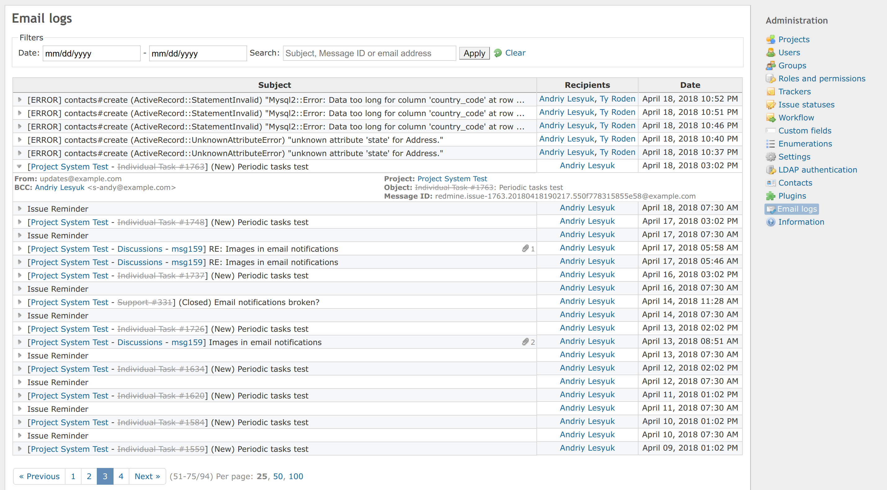
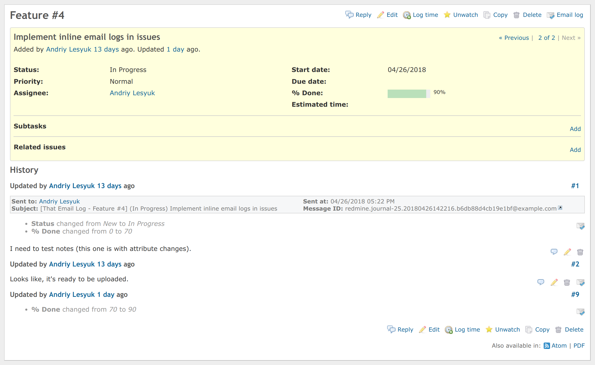

# That Email Log Plugin

This plugin enables logging of all outgoing email messages, that are sent by Redmine.

After installing this plugin you will see email logs under the new menu item in **Administration**:

If **Contextual email logs** are enabled in the plugin's settings (they are by default), email logs can also be accessed via the contextual links in issues and messages:

## Installation

- Move `that_email_log` directory to the `plugins` directory of Redmine
- Run `rake redmine:plugins:migrate RAILS_ENV=production`
- Restart Redmine

## License

GNU General Public License (GPL) v2.0

## Used Icons

- https://www.iconfinder.com/icons/95877/check_email_ok_icon (Icojam)
- https://www.iconfinder.com/icons/18351/link_icon (Everaldo Coelho)
